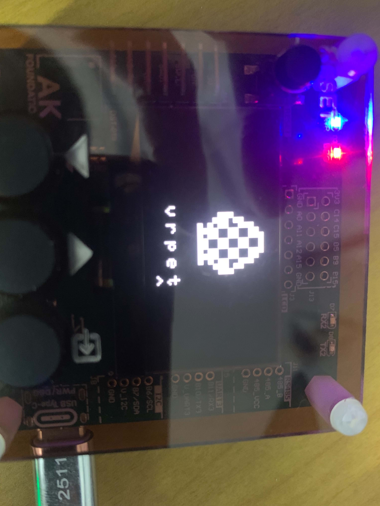
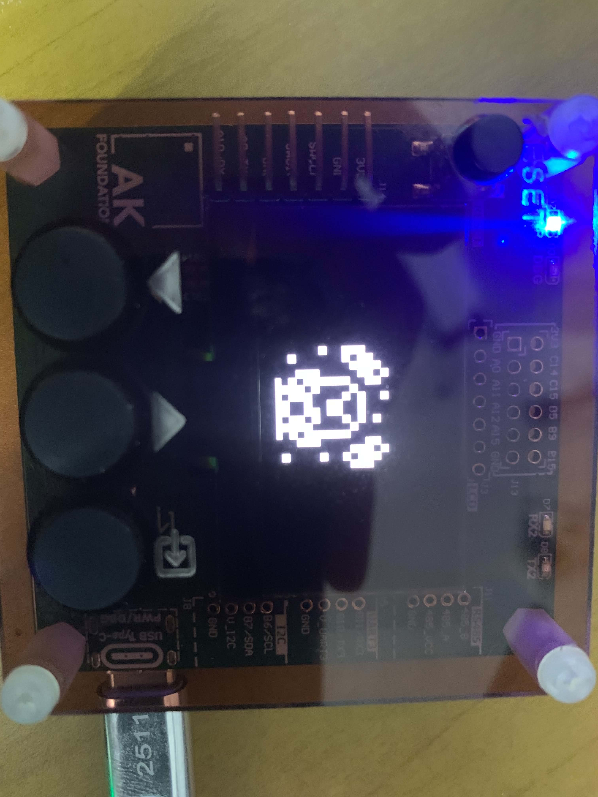
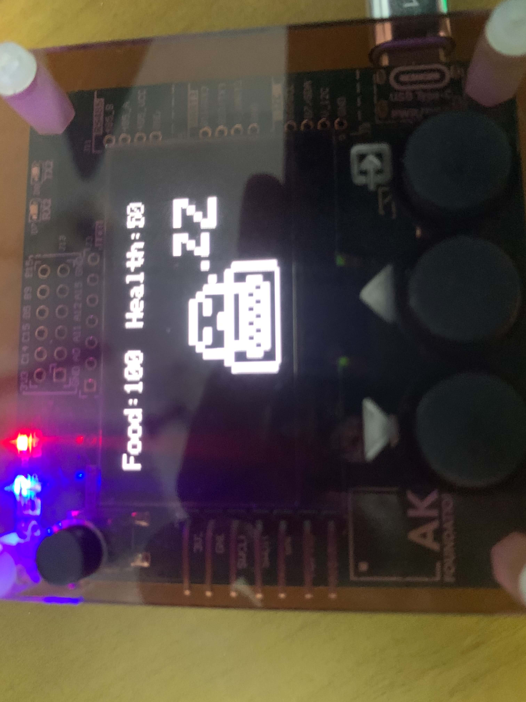
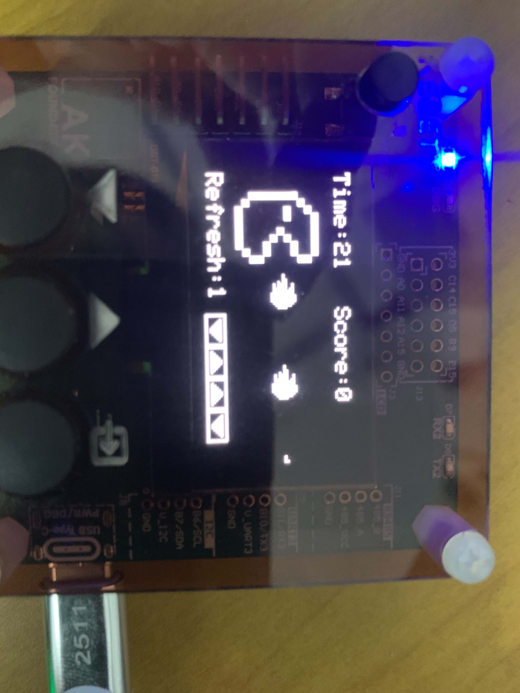

# VirtualPet - Build on AK Embedded Base Kit
## Screenshot
<table>
  <tr>
    <td align="center" width="25%">
       
      <b>Set Name</b>
    </td>
    <td align="center" width="25%">
       
      <b>Egg hatch</b>
    </td>
    <td align="center" width="25%">
       
      <b>Pet sleep</b>
    </td>
    <td align="center" width="25%">
       
      <b>Training</b>
    </td>
  </tr>
</table>

## What's completed
- You can set name for your pet
- Do some activities like eat, sleep, train or clean
- The pet will appear happy, dislike or reject
- You can see your pet's info in status screen
- Update a little sound effect for button

## Planned Features
- Update new rule for status screen
- Update more sound and sound effects
- Update new evolutionary form
